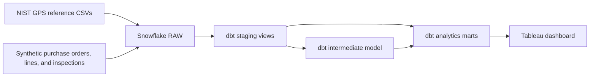

# Supplier Risk and Procurement Performance

An end-to-end analytics project that uses **Snowflake**, **dbt**, and **Tableau** to evaluate procurement spend, delivery performance, supplier quality, and open-order exposure.

[View the interactive Tableau dashboard](https://public.tableau.com/views/SupplierRiskandProcurementPerformance/Dashboard1?:showVizHome=no)


## Project objective

Procurement teams need a consistent way to identify supplier risk and monitor purchasing performance. This project creates a reproducible analytics pipeline that answers:

- How much has the organization spent?
- What percentage of delivered order lines arrived on time?
- What is the overall inspection defect rate?
- How much value remains exposed in open orders?
- Which suppliers require the most attention?

## Results from the synthetic scenario

| KPI | Result |
|---|---:|
| Total procurement spend | $528.14M |
| On-time delivery | 21.58% |
| Defect rate | 0.96% |
| Open-order exposure | $27.41M |

These figures describe a **synthetic procurement scenario**, not the performance of real organizations or suppliers. The intentionally challenging delivery scenario makes supplier-risk patterns visible for analysis.

## Architecture



## Technology used

- **Snowflake** for cloud data storage and SQL processing
- **dbt** for modular transformations, documentation, lineage, and testing
- **Tableau Public** for dashboard development and publishing
- **SQL, YAML, CSV, and GitHub** for implementation and documentation

## Data

The supplier, project, and product reference files are from the NIST GPS Manufacturer sample dataset. Purchase orders, order lines, delivery dates, prices, quantities, and inspections were generated in Snowflake for academic use. See [methodology](docs/methodology.md) for the distinction.

## Repository structure

```text
snowflake/            Environment, raw-table, and synthetic-data SQL
supply_chain_dbt/     dbt project, models, tests, and example profile
data/source/          NIST GPS reference CSV files
data/outputs/         Final dbt mart exports used for analysis
dashboard/            Tableau dashboard image and public link
docs/                 Architecture, methodology, and data dictionary
```

## Reproduce the project

1. Create a Snowflake account or use an existing one.
2. Run the scripts in `snowflake/` in numeric order.
3. After script 02, load the three CSVs from `data/source/` into their matching raw tables:
   - `GPS_suppliers.csv` → `RAW_SUPPLIERS`
   - `GPS_projects.csv` → `RAW_PROJECTS`
   - `GPS_products.csv` → `RAW_PRODUCTS`
4. Continue with scripts 03–06 to create the synthetic operational data.
5. Copy `supply_chain_dbt/profiles.example.yml` to your dbt profiles location and adjust the role, warehouse, database, and schema if necessary.
6. From `supply_chain_dbt/`, run:

   ```bash
   dbt run --target dev
   dbt test --target dev
   ```

7. Connect Tableau to the marts or use the included output CSVs.

Snowflake trial accounts can expire, but the SQL, dbt code, data exports, dashboard image, and documentation in this repository remain available.

## Analytics models

- `purchase_order_analysis`: line-level analysis combining orders, suppliers, products, deliveries, prices, and inspections.
- `supplier_performance`: supplier-level KPIs and risk classification.
- `int_product_suppliers`: resolves semicolon-separated product-to-supplier values and identifies unmatched supplier IDs.

## Data quality controls

The project tests primary identifiers for uniqueness and completeness, validates accepted order statuses, checks model relationships, and rejects impossible quantity combinations such as rejected units exceeding inspected units.

## Limitations

- Operational transactions are synthetic and should not be treated as real business evidence.
- The supplier risk thresholds are illustrative business rules, not a validated production scoring model.
- Tableau Public workbooks are public; confidential data should never be published there.

## Author

Madhu Damani
