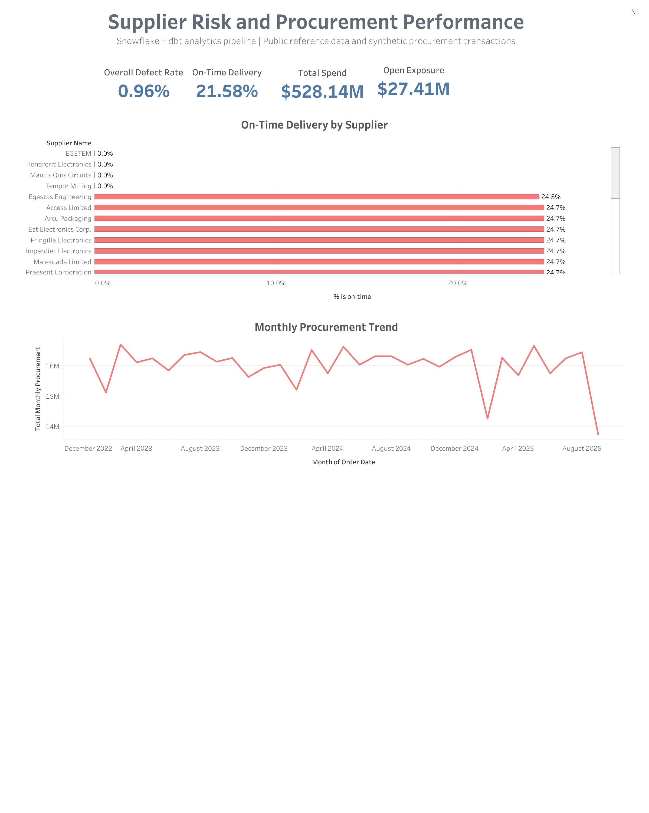
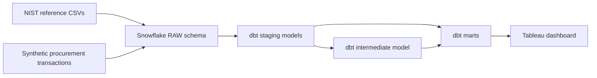

# Supplier Risk and Procurement Performance

An end-to-end analytics project using **Snowflake, dbt, SQL, and Tableau** to transform procurement data into supplier performance and risk insights.

[View the interactive Tableau dashboard](https://public.tableau.com/views/SupplierRiskandProcurementPerformance/Dashboard1?:showVizHome=no)



## Business problem

Consider an electronics manufacturer that purchases screens, batteries, microcontrollers, and other components from several suppliers.

A supplier offering the lowest price is not always the best-performing supplier. Late deliveries can interrupt production, defective components can create rework, and unfinished purchase orders can leave significant value exposed. However, the information needed to evaluate these risks may be distributed across supplier records, product files, purchase orders, delivery dates, and inspection results.

The procurement team needs a consolidated view that answers:

- How much are we spending with suppliers?
- Are suppliers meeting promised delivery dates?
- What percentage of inspected units are defective?
- How much value is tied to open purchase orders?
- Which suppliers show higher delivery or quality risk?

This project creates that analytical view.

> A company such as Apple is a useful real-world analogy because it depends on many component suppliers, but this project does **not** use Apple data. Supplier, project, and product reference files come from a NIST sample dataset. Purchase orders, order lines, deliveries, prices, and inspections are synthetic.

## Project objective

The primary objective was to learn how a modern analytics workflow operates:

1. Store raw data in a cloud data warehouse.
2. Transform raw tables into analysis-ready models.
3. Apply automated data-quality tests.
4. Build business KPIs from the transformed data.
5. Present the results in an interactive dashboard.

The project is intentionally scoped for an associate-level data analyst or analytics engineer. It demonstrates the relationship between Snowflake, dbt, and Tableau without adding unnecessary orchestration, machine learning, or production infrastructure.

## Solution architecture



### Snowflake

Snowflake serves as the cloud data warehouse. It stores and processes supplier, product, purchase-order, delivery, and inspection data.

The database is organized into four schemas:

| Schema | Purpose |
|---|---|
| `RAW` | Original reference data and generated procurement transactions |
| `STAGING` | Cleaned, renamed, and typed source data |
| `INTERMEDIATE` | Reusable transformation logic and relationships |
| `MARTS` | Final business-level tables used for analysis and reporting |

An X-Small virtual warehouse provides the compute required to execute SQL queries and dbt models. Auto-suspend is enabled to reduce unnecessary credit usage.

### dbt

dbt manages the SQL transformation layer. Snowflake executes the SQL, while dbt organizes models, dependencies, materializations, documentation, and tests.

The project uses:

- `source()` to identify raw Snowflake tables
- `ref()` to connect models and establish dependency order
- Staging views to standardize names, text values, dates, and data types
- An intermediate view to parse product-to-supplier relationships
- Mart tables to store analysis-ready procurement results
- Schema tests for uniqueness, completeness, accepted values, and referential integrity
- A custom singular test for invalid order and inspection quantities
- A custom schema-name macro so models build directly into the intended schemas

### Tableau

Tableau consumes the final dbt mart output. The dashboard summarizes procurement spend, on-time delivery, quality, open-order exposure, supplier performance, and monthly trends.

## Data model

```text
SUPPLIERS ──< PURCHASE ORDERS ──< PURCHASE ORDER LINES >── PRODUCTS
                                          │
                                          └── INSPECTIONS
```

- One supplier can have many purchase orders.
- One purchase order can contain many order lines.
- Each order line references one product.
- A delivered order line can have an inspection record.

### Final marts

#### `purchase_order_analysis`

**Grain:** one row per purchase-order line.

This mart combines order, supplier, product, delivery, pricing, and inspection data. It calculates:

- Order-line value
- Price variance amount
- Days late
- On-time delivery indicator
- Line-level defect rate
- Open-order exposure

#### `supplier_performance`

**Grain:** one row per supplier.

This mart aggregates line-level data into:

- Total orders and order lines
- Total spend
- Total price variance
- Average days late
- On-time delivery percentage
- Defect-rate percentage
- Open-order exposure
- Illustrative supplier-risk level

## KPI definitions

| KPI | Definition |
|---|---|
| **Total spend** | Sum of `ordered quantity × unit price` across purchase-order lines |
| **On-time delivery %** | Delivered lines received on or before the promised date divided by delivered lines |
| **Defect rate %** | Total rejected units divided by total inspected units |
| **Open-order exposure** | Order-line value associated with purchase orders having an `OPEN` status |
| **Supplier risk level** | Illustrative classification based on delivery and defect-rate thresholds |

For example, if 1,000 units were promised for March 1, delivered on March 8, and 20 units failed inspection, the delivery was seven days late and the inspection defect rate was 2%.

## Results from the synthetic scenario

| KPI | Result |
|---|---:|
| Total procurement spend | $528.14M |
| On-time delivery | 21.58% |
| Defect rate | 0.96% |
| Open-order exposure | $27.41M |

These values describe a synthetic learning scenario and should not be interpreted as real organizational performance. The scenario intentionally produces a visible delivery-performance problem for analysis.

## Data-quality testing

The dbt project validates:

- Primary identifiers are not null and unique.
- Purchase orders reference valid suppliers.
- Order lines reference valid orders and products.
- Inspections reference valid order lines.
- Order statuses belong to the accepted set: `OPEN`, `CLOSED`, or `CANCELLED`.
- Ordered, received, inspected, and rejected quantities remain within valid ranges.
- Rejected quantity never exceeds inspected quantity.
- Received quantity never exceeds ordered quantity.

A failing test returns the invalid records so they can be investigated before the marts are used for reporting.

## Repository structure

```text
snowflake/
  01_setup.sql
  02_create_raw_tables.sql
  03_create_operational_tables.sql
  04_generate_purchase_orders.sql
  05_generate_order_lines.sql
  06_generate_inspections.sql

supply_chain_dbt/
  macros/
  models/staging/
  models/intermediate/
  models/marts/
  tests/

data/source/          NIST reference CSV files
data/outputs/         Exports of the final dbt marts
dashboard/            Dashboard image and Tableau Public link
docs/                 Architecture, methodology, and data dictionary
```

## How to reproduce the project

1. Create or open a Snowflake account.
2. Run the files in `snowflake/` in numeric order.
3. After script 02, load the source files into their matching raw tables:
   - `GPS_suppliers.csv` → `RAW_SUPPLIERS`
   - `GPS_projects.csv` → `RAW_PROJECTS`
   - `GPS_products.csv` → `RAW_PRODUCTS`
4. Run scripts 03–06 to create the synthetic operational tables and records.
5. Copy `supply_chain_dbt/profiles.example.yml` to the appropriate dbt profiles location and update the connection settings if required.
6. From the dbt project directory, run:

   ```bash
   dbt run --target dev
   dbt test --target dev
   ```

7. Connect Tableau to the `MARTS` models or use the CSV exports in `data/outputs/`.

The Snowflake trial may expire, but the SQL, dbt code, data exports, dashboard image, and documentation remain available in this repository.

## What I learned

- How Snowflake warehouses, databases, schemas, and tables work together
- How to create a layered warehouse structure using raw, staging, intermediate, and mart schemas
- How dbt models modularize SQL transformations
- How `source()` and `ref()` create lineage and control execution order
- How dbt materializations determine whether models become views or tables
- How dbt tests validate data quality and referential integrity
- How to define model grain and calculate procurement KPIs
- How Tableau uses a final analytics mart for reporting
- How data moves from source files to a decision-support dashboard

## Interview explanation

> Procurement teams cannot evaluate suppliers using price alone because late deliveries, defective products, and unfinished orders create operational and financial risk. I built this academic project to understand a modern analytics workflow. I stored the raw data in Snowflake, used dbt to create staged and analysis-ready models, added data-quality tests, and built procurement KPIs at the order-line and supplier levels. I then used the final marts in Tableau to create a supplier-performance dashboard. The operational transactions are synthetic, so the project demonstrates the technical workflow rather than claiming real company findings.

## Limitations

- Operational transactions are synthetic.
- Supplier-risk thresholds are illustrative rules rather than a validated production model.
- The project demonstrates batch analytics and does not implement real-time ingestion or orchestration.
- Tableau Public is public and should not contain confidential business data.

## Author

Madhu Damani
